# Hi Engineer, TAF INC 🌐

<br>


# Milestone 1 Assignment Website Project

<p>This website is a website project built with HTML with semantic tag & CSS. This project takes the theme IT Business 😁</p>

## Setup Guide
<p>Tools</p>
- A web browser Recommended Google Chrome
- Internet connection

**Clone the Repository:**

   ```bash
   git clone git@github.com:revou-fsse-5/milestone-1-FabianusArdian.git
   ```

## Deployment :
###### 🖥 Deployment on Github with Netlify
<p>🏳Register on Netlify, then connect to your GitHub account and provide permission to use the repository</p>
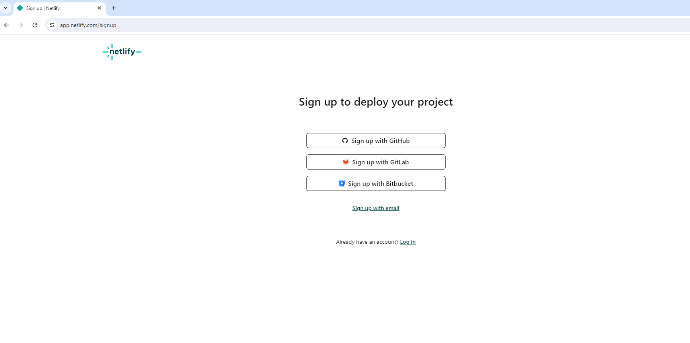
<p> then add a new website by importing it from the project you created on GitHub.</p>
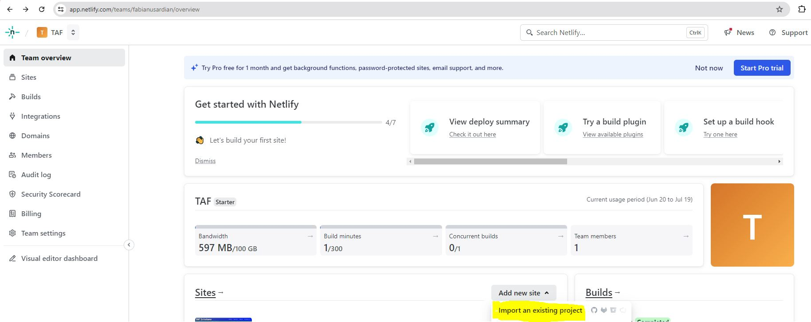
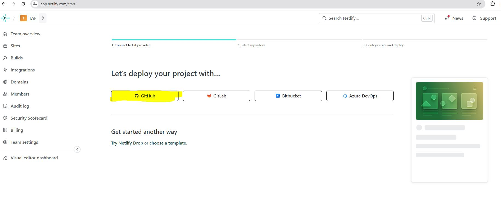
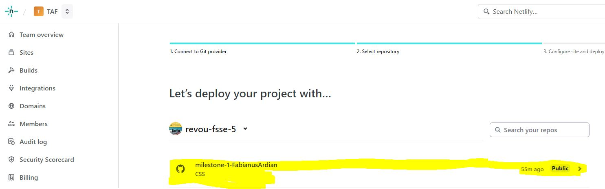
<p> create a site with the name you want, this is the name of the site that I created on netlify https://tafinc.netlify.app/</p>
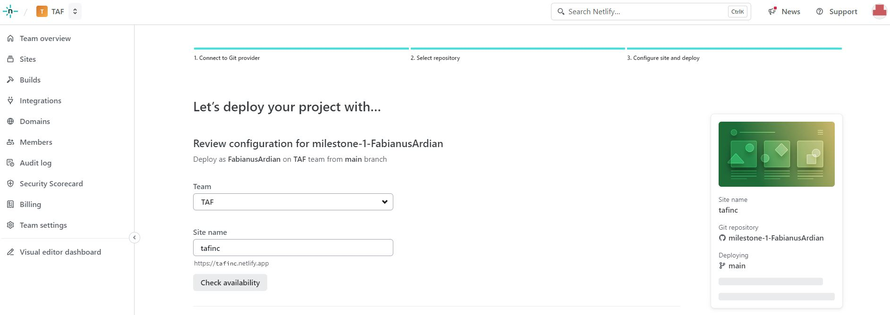
<p>After the site address is created, if you make changes to the data in the repository, any data that is changed will immediately be updated on the site that we have created.</p>

###### 💻 Connect a Custom Domain and DNS using niagahoster.co.id services
<p>🏳Register on Niagahoster, use Google Acount</p>
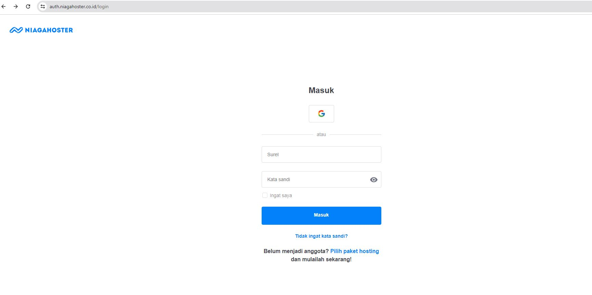
<p>then search for the desired domain name then we pay for the selected domain</p>
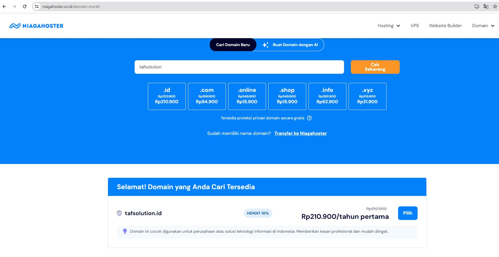
<p>After this you will be directed to the Niagahoster domain management page</p>
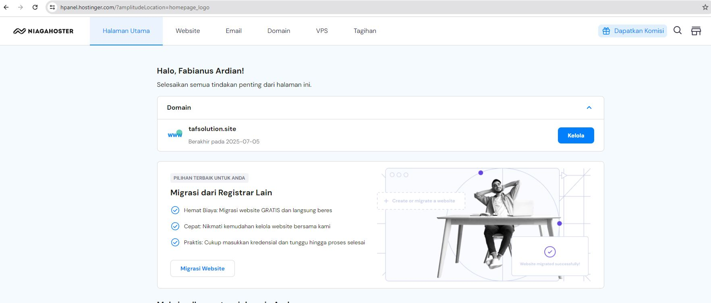
<p>Return to Netlify, go to the section of the site you created</p>
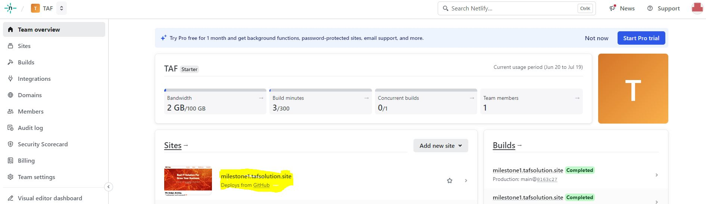
<p>Go to the domain management submenu and add the custom domain that you have purchased</p>
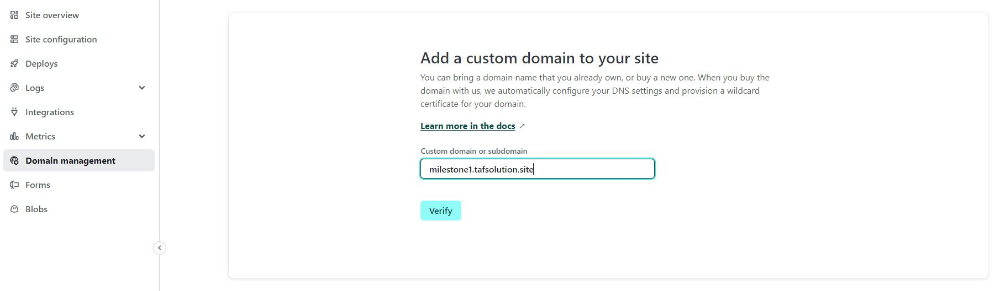
<p>then return to the domain management submenu, select the custom domain that has been added, then select options and select Go To DNS Panel</p>
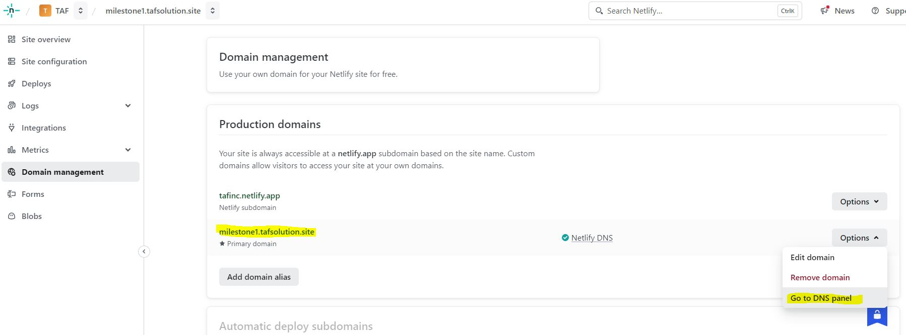
<p>Copy several name servers that have been provided by Netlify to the DNS/Name Server on Niagahoster so that the custom domain that has been added can be accessed</p>
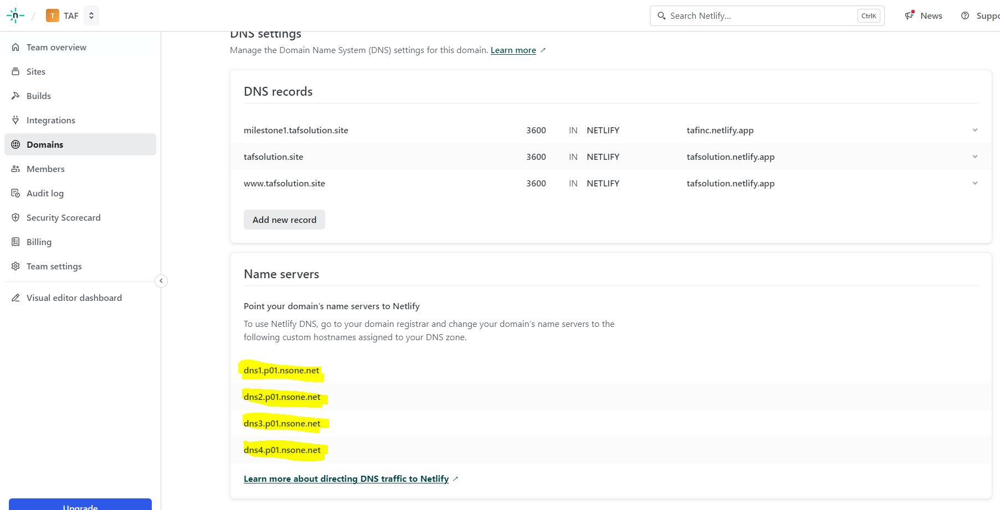
<p>Return to the domain menu on Niagahoster, select the custom domain that you have purchased and go to the DNS/Name Sever submenu.
Go to the DNS Record section, select the server name, then change the server from the Netlify name server, then save</p>
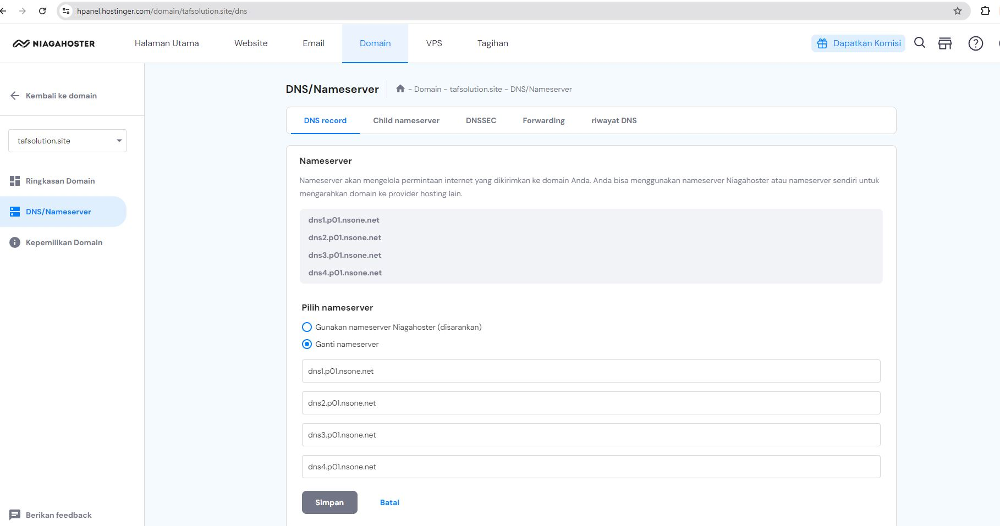
<p>Wait a few moments and the custom domain you have selected can be accessed properly</p>

# Documentation Website Project Page Structure

## Head
`meta` : tag for charset, viewport, title, description, keywords, language, etc.
`title' : title name website "TAF Inc."
<p>This website does not use other extensions, only uses CSS</p>

## Body : 
### `header` : Which is used to define the title and sub-headings of a web page.
- `Nav-Header` : for navigation menu 
- `Video-Container` : Use video as background and add H1 to website vision

*Header screen display desktop*
<br>

*Header screen display mobile*
<br>


### `main` : The main content website.
- `section1` :  There are articles and pictures illustrating it business. There is animation in the picture.

*section1 screen display desktop*
<br>

*section1 screen display mobile*
<br>

- `section2` : There is a grid accompanied by images and text that can change.

*section2 screen display desktop*
<br>

*section2 screen display mobile*
<br>


- `section3` : 
This section is divided into 2 containers, the first is a project that is already running and the second container is a consultation form with various input types.

*section3 screen display desktop*
<br>

*section3 screen display mobile*
<br>


- `section4` : 
The last section contains the work flow of this company, explained in 3 processes and there is a hover background

*section4 screen display desktop*

<br>
*section4 screen display mobile*
<br>


### `footer` : The footer contains information regarding copyright, sublinks, contact and address

*footer screen display desktop*

<br>
*footer screen display mobile*
<br>

<br>

## Responsive Design
<br>
● Implement CSS media queries for screen 768 px & 468 px
<br>
● Ensure that the layout adapts smoothly to different screen sizes and orientations.
<br>
● Use relative units for sizing elements to maintain a consistent layout across devices.
<br>
● Adjust typography (use 2 fonts & various font style) & various font sizes to ensure readability on various screen sizes.
<br>
● Optimize images and other media for different resolutions and device capabilities.
<br>
● Implement CSS animation.

<br>
🌏 https://milestone1.tafsolution.site/
<p>🙌 From Ardian</p>
<p>👨‍💻 Trying to become a software engineer</p>

